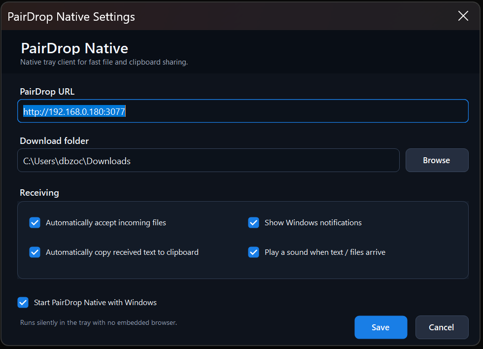
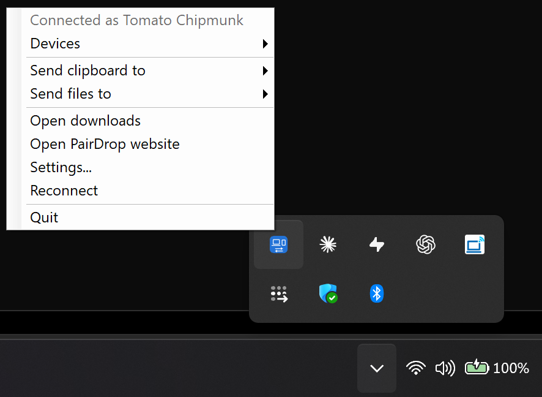

# 💧 PairDrop Native for Windows

A lightweight native Windows system-tray client for [PairDrop](https://github.com/schlagmichdoch/PairDrop), designed for fast, frictionless file and clipboard sharing between your devices.

**No embedded browser. No WebView2. No subscription.** PairDrop Native talks directly to PairDrop's WebSocket fallback protocol and stays quietly connected in the Windows tray.

[**Download the latest Windows release**](https://github.com/iOnic-Developer/PairDrop-Windows-Native/releases/latest/download/PairDropNative.exe) · [View releases](https://github.com/iOnic-Developer/PairDrop-Windows-Native/releases)

---

## ✨ Features

- **Tray-only Windows client** — runs quietly in the notification area without a permanent app window.
- **Automatic device discovery** — appears as a normal PairDrop peer on your self-hosted instance.
- **Auto-accept files** — incoming files are accepted automatically and streamed directly to disk.
- **Instant clipboard receiving** — received text can be copied straight to the Windows clipboard.
- **Native notifications** — separate Windows notifications for clipboard text, images and other files.
- **Receive sound** — optional audio notification whenever text or files arrive.
- **Direct sending from the tray** — send clipboard text or select files for any currently visible PairDrop device.
- **Persistent identity** — remembers its PairDrop peer identity between launches.
- **Start with Windows** — stays available in the background after login.
- **No browser runtime** — the client is independent of PairDrop's HTML/CSS interface.

## 📸 Screenshots

<table>
  <tr>
    <td width="55%"></td>
    <td width="45%"></td>
  </tr>
  <tr>
    <td align="center"><strong>Native settings</strong></td>
    <td align="center"><strong>System tray menu</strong></td>
  </tr>
</table>

---

## 🚀 Installation

### 1. PairDrop server — Unraid / Docker

The Windows client requires PairDrop's WebSocket fallback mode:

```text
WS_FALLBACK=true
```

PairDrop Native advertises itself as:

```text
webrtc_supported=false
```

This tells normal PairDrop browser clients to use PairDrop's existing `WSPeer` fallback protocol when communicating with the Windows client.

> **Important:** WebSocket fallback relays transfer data through your PairDrop server rather than using a direct WebRTC peer-to-peer data channel.

### NGINX gateway

The example deployment below places a tiny NGINX container in front of PairDrop. It handles WebSocket proxying and intentionally removes client-IP forwarding headers so devices using this **private instance** are placed into the same PairDrop IP discovery group.

> [!WARNING]
> Only use this configuration on a PairDrop instance you control and restrict access to. Removing the forwarded client IP means visitors to the instance can become visible to each other as peers.

Create the configuration directory and file on Unraid:

```bash
mkdir -p /mnt/user/appdata/pairdrop-gateway

cat > /mnt/user/appdata/pairdrop-gateway/default.conf <<'EOF'
server {
    listen 80;

    location / {
        proxy_pass http://pairdrop:3000;

        proxy_http_version 1.1;
        proxy_set_header Host $host;
        proxy_set_header Upgrade $http_upgrade;
        proxy_set_header Connection "upgrade";

        proxy_set_header X-Forwarded-For "";
        proxy_set_header X-Real-IP "";
        proxy_set_header CF-Connecting-IP "";

        proxy_read_timeout 3600;
        proxy_send_timeout 3600;
    }
}
EOF
```

### Docker Compose

Create/deploy the following `docker-compose.yml`:

```yaml
services:
  pairdrop:
    image: lscr.io/linuxserver/pairdrop:latest
    container_name: pairdrop
    restart: unless-stopped
    environment:
      - PUID=99
      - PGID=100
      - TZ=Europe/London
      - WS_FALLBACK=true
      - RATE_LIMIT=false
      - DEBUG_MODE=false
    networks:
      - pairdrop-net

  pairdrop-gateway:
    image: nginx:alpine
    container_name: pairdrop-gateway
    restart: unless-stopped
    depends_on:
      - pairdrop
    volumes:
      - /mnt/user/appdata/pairdrop-gateway/default.conf:/etc/nginx/conf.d/default.conf:ro
    ports:
      - 3077:80
    networks:
      - pairdrop-net

networks:
  pairdrop-net:
    driver: bridge
```

PairDrop will then be available through the gateway at:

```text
http://YOUR-UNRAID-IP:3077
```

If troubleshooting peer discovery, temporarily set `DEBUG_MODE=true` and inspect the PairDrop container logs. Set it back to `false` once everything is working.

---

## 🪟 Windows client

### Option A — Download the release

1. Download [`PairDropNative.exe`](https://github.com/iOnic-Developer/PairDrop-Windows-Native/releases/latest/download/PairDropNative.exe) from the latest release.
2. Place it somewhere permanent, for example:

   ```text
   C:\Program Files\PairDrop Native\PairDropNative.exe
   ```

3. Run the executable.
4. Configure your PairDrop URL and download folder.
5. Enable **Start PairDrop Native with Windows** if desired.

After setup, the application runs from the Windows system tray.

### Option B — Build from source

PairDrop Native targets **.NET 8 for Windows**.

Clone or extract the repository, then run:

```powershell
cd C:\pairdrop-native
powershell -ExecutionPolicy Bypass -File .\build.ps1
```

If the .NET 8 SDK is not installed:

```powershell
winget install Microsoft.DotNet.SDK.8
```

The compiled application is written to:

```text
C:\pairdrop-native\publish\PairDropNative.exe
```

---

## ⚙️ First launch

The settings window lets you configure:

- **PairDrop URL** — for example `http://192.168.0.180:3077` or your HTTPS endpoint.
- **Download folder** — where incoming files are saved.
- **Automatically accept incoming files**.
- **Automatically copy received text to clipboard**.
- **Windows notifications**.
- **Receive sound**.
- **Start with Windows**.

### Tray menu

Right-click the PairDrop Native tray icon to access:

```text
Connection status
Devices
Send clipboard to → device
Send files to → device
Open downloads
Open PairDrop website
Settings
Reconnect
Quit
```

---

## 🌍 Global access with Cloudflare Tunnel

You can expose PairDrop through a Cloudflare Tunnel while keeping the Windows client connected directly over your LAN.

A practical setup is:

```text
Phone / remote browser
        │
        ▼
https://share.example.com
        │
        ▼
Cloudflare Tunnel / Access
        │
        ▼
PairDrop gateway :3077
        │
        ▼
PairDrop

Windows PairDrop Native
        │
        └──── http://LAN-IP:3077 ────► gateway
```

### Suggested configuration

1. Point a Cloudflare Tunnel hostname such as `share.example.com` at the PairDrop gateway.
2. Protect the public hostname with **Cloudflare Access** if the instance is private.
3. Open the public HTTPS URL from phones and remote devices.
4. Configure PairDrop Native on Windows with the **local gateway URL**, for example:

   ```text
   http://192.168.0.180:3077
   ```

Using the LAN URL lets the native Windows client remain permanently connected without needing to complete an interactive Cloudflare Access login.

---

## 🔧 How it works

PairDrop Native implements the relevant parts of PairDrop's open-source WebSocket fallback protocol directly in C#.

The client connects using:

```text
/server?webrtc_supported=false
```

and handles protocol messages including:

```text
join-ip-room
signal
request
files-transfer-response
header
ws-chunk
partition
partition-received
progress
file-transfer-complete
text
message-transfer-complete
```

Incoming file data is streamed directly to disk instead of being held inside an embedded browser. Received clipboard text can be copied directly into the Windows clipboard.

---

## 📝 Version history

<details>
<summary><strong>Development history</strong></summary>

### v0.6 — UI polish

- Improved spacing around the settings footer and action buttons.
- Final dark-theme layout refinements.

### v0.5 — DPI/layout fixes

- Removed problematic WinForms DPI autoscaling from the custom-drawn settings UI.
- Switched to consistent pixel-based fonts and dimensions.
- Fixed oversized settings windows at 125% / 150% Windows scaling.
- Fixed clipped headings and checkbox labels.
- Retained the dark theme, rounded controls and blue accent.

### v0.4 — Settings redesign

- Added a dark Windows title bar on supported Windows 10/11 builds.
- Added rounded dark input fields and receiving card.
- Added custom dark checkboxes with blue accents.
- Added modern rounded buttons.

### v0.3 — UI refresh

- Introduced the modern dark theme.
- Improved spacing and typography.
- Enlarged URL and download fields.

### v0.2 — Transfer and notification fixes

- Mirrored PairDrop's transfer-completion behaviour more closely.
- Added incoming transfer progress updates including final 100% completion.
- Added partition acknowledgement handling.
- Fixed zero-byte file completion.
- Text sends now wait for `message-transfer-complete`.
- Added receive sounds and improved clipboard/image/file notifications.

</details>

---

## 🙏 Credits

PairDrop Native is an independent Windows client built around the protocol used by the excellent open-source [PairDrop](https://github.com/schlagmichdoch/PairDrop) project.

PairDrop itself remains the server and browser-side foundation for device discovery and transfers.
